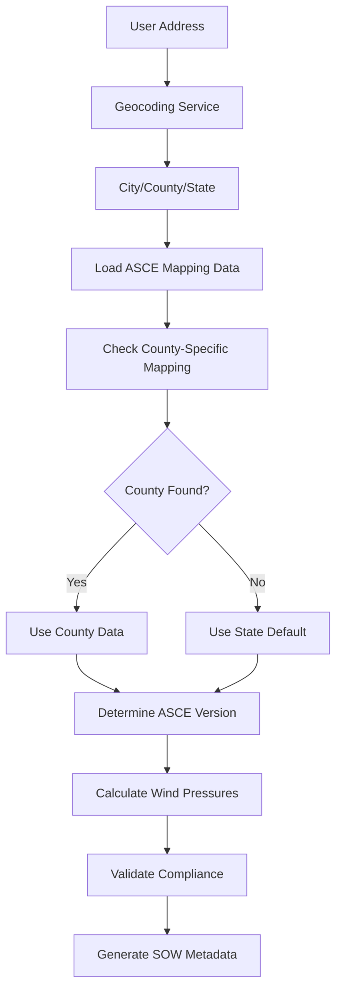

# Jurisdiction-Based Code Logic Implementation

## Overview

This implementation adds comprehensive jurisdiction-based code logic to the SOW Generator, enabling automatic determination of applicable ASCE versions, building code cycles, and HVHZ requirements based on project address.

## Key Features Implemented

### 1. **Jurisdiction-to-Code Mapping System** 
- **File**: `server/data/asce-mapping.json`
- **Function**: Maps `city|county|state` combinations to applicable building codes
- **Structure**: 
  ```json
  {
    "states": {
      "FL": {
        "defaultCode": "2023 FBC",
        "defaultASCE": "7-16",
        "counties": {
          "Miami-Dade County": {
            "codeCycle": "2023 FBC",
            "asceVersion": "7-16", 
            "hvhz": true,
            "windSpeed": 185,
            "specialRequirements": ["TAS-100", "NOA-Required"]
          }
        }
      }
    }
  }
  ```

### 2. **Address-to-Jurisdiction Pipeline**
- **File**: `server/lib/jurisdiction-mapping.ts`
- **Functions**:
  - `getJurisdictionFromAddress(address)` - Converts address to city/county/state
  - `getCodeData(jurisdiction)` - Returns ASCE version, code cycle, HVHZ status
  - `createJurisdictionSummary(address)` - Generates complete jurisdiction metadata

### 3. **ASCE Version-Specific Wind Calculations**
- **File**: `server/lib/wind-analysis.ts`
- **Enhancement**: Supports ASCE 7-10, 7-16, and 7-22 calculation methods
- **Features**:
  - Version-specific pressure coefficients
  - Enhanced zone pressure calculations (4 zones for 7-16/7-22, 3 zones for 7-10)
  - Jurisdiction-based wind speed mapping
  - Detailed calculation factor reporting

### 4. **Comprehensive Analysis Engine**
- **File**: `server/lib/jurisdiction-analysis.ts`
- **Main Function**: `performComprehensiveAnalysis(address, buildingHeight, exposureCategory)`
- **Output**: Complete analysis including:
  - Geocoding results
  - Jurisdiction determination  
  - Wind pressure calculations
  - Compliance validation
  - SOW metadata generation

### 5. **API Endpoints**
- **File**: `server/routes/jurisdiction.ts`
- **Endpoints**:
  - `POST /api/jurisdiction/analyze` - Full jurisdiction analysis
  - `POST /api/jurisdiction/lookup` - Quick code lookup by county/state
  - `POST /api/jurisdiction/geocode` - Address geocoding
  - `POST /api/jurisdiction/codes` - Get ASCE/code data
  - `POST /api/jurisdiction/validate` - Compliance validation
  - `POST /api/jurisdiction/pressure-table` - Generate pressure tables
  - `POST /api/jurisdiction/debug` - Debug analysis pipeline

## Usage Examples

### Basic Jurisdiction Analysis
```typescript
// Request
POST /api/jurisdiction/analyze
{
  "address": "2650 NW 89th Ct, Doral, FL 33172",
  "buildingHeight": 30
}

// Response
{
  "success": true,
  "analysis": {
    "jurisdiction": {
      "county": "Miami-Dade County",
      "state": "FL", 
      "codeCycle": "2023 FBC",
      "asceVersion": "ASCE 7-16",
      "hvhz": true
    },
    "windAnalysis": {
      "designWindSpeed": 185,
      "exposureCategory": "C",
      "zonePressures": {
        "zone1Field": -70.57,
        "zone1Perimeter": -122.84,
        "zone2Perimeter": -162.04,
        "zone3Corner": -220.85
      }
    }
  }
}
```

### Integration with SOW Generation
```typescript
// Enhanced SOW generation now includes:
const analysis = await performComprehensiveAnalysis(address, buildingHeight);

// Automatically determines:
// - ASCE version (7-10, 7-16, or 7-22)
// - Building code cycle (2023 FBC, 2021 IBC, etc.)
// - HVHZ requirements
// - Special compliance requirements (NOA, TAS-100, etc.)
// - Appropriate wind pressure calculation method
```

## Jurisdiction Logic Flow



## ASCE Version Selection Logic

1. **Load jurisdiction mapping data** from `asce-mapping.json`
2. **Geocode address** to determine city/county/state
3. **Check for county-specific mapping**:
   - If found: Use county's ASCE version and code cycle
   - If not found: Use state default
4. **Apply version-specific calculations**:
   - ASCE 7-22: Latest coefficients and 4-zone system
   - ASCE 7-16: Current standard with 4-zone system  
   - ASCE 7-10: Legacy 3-zone system for older jurisdictions

## HVHZ and Special Requirements

### Florida HVHZ Counties
- **Miami-Dade County**: HVHZ, TAS-100, NOA Required, Third-Party Inspection
- **Broward County**: HVHZ, NOA Required
- **Monroe County**: HVHZ, TAS-100, NOA Required  
- **Palm Beach County**: HVHZ, NOA Required

### Special Requirements Handling
```typescript
if (jurisdiction.hvhz) {
  requiredActions.push('Florida Product Approval (NOA/ESR) required');
  requiredActions.push('HVHZ-compliant installation methods required');
  
  if (jurisdiction.specialRequirements?.includes('TAS-100')) {
    requiredActions.push('TAS-100 impact resistance testing required');
  }
}
```

## Wind Pressure Calculation Enhancements

### Version-Specific Coefficients
```typescript
// ASCE 7-16/7-22 (4 zones)
{
  zone1Field: -0.9,      // Zone 1' (interior field)
  zone1Perimeter: -1.4,  // Zone 1 (inner perimeter)  
  zone2Perimeter: -2.0,  // Zone 2 (outer perimeter)
  zone3Corner: -2.8      // Zone 3 (corner)
}

// ASCE 7-10 (3 zones)
{
  zone1Field: -0.7,      // Zone 1 (field)
  zone1Perimeter: -1.0,  // Zone 2 (perimeter)
  zone2Perimeter: -1.4,  // Zone 2 (perimeter)
  zone3Corner: -2.0      // Zone 3 (corner)
}
```

### Enhanced Wind Speed Mapping
- **Florida HVHZ**: 175-185 mph based on specific county
- **Texas Gulf Coast**: 145 mph for Houston area
- **California**: 85 mph (seismic typically governs)
- **Default**: 115 mph for unmapped areas

## Compliance Validation

### Validation Checks
1. **HVHZ Compliance**: NOA/ESR requirements, installation methods
2. **Wind Pressure Limits**: Manufacturer system ratings vs calculated pressures
3. **Elevation Effects**: Topographic factor adjustments for high elevations
4. **Exposure Category**: Coastal (D) vs urban (B) vs open terrain (C)

### Output Format
```typescript
{
  isValid: boolean,
  warnings: string[],           // Non-critical issues
  recommendations: string[],    // Best practices
  requiredActions: string[]     // Mandatory compliance items
}
```

## Error Handling and Fallbacks

### Geocoding Fallbacks
1. **Primary**: OpenCage API with valid API key
2. **Fallback**: Pattern matching for common cities
3. **Default**: Dallas, TX coordinates for unknown addresses

### Jurisdiction Mapping Fallbacks  
1. **Primary**: County-specific mapping from asce-mapping.json
2. **Fallback**: State default values
3. **Default**: 2021 IBC with ASCE 7-16 for unmapped states

### Wind Calculation Fallbacks
1. **Primary**: Geographic wind speed mapping  
2. **Fallback**: Default 115 mph for unmapped regions
3. **Safety Factor**: Conservative pressure coefficients

## Testing and Debugging

### Debug Endpoints
- `POST /api/jurisdiction/debug` - Step-by-step analysis debugging
- `GET /api/jurisdiction/health` - Service health check with test case

### Test Cases
- **Miami HVHZ**: `2650 NW 89th Ct, Doral, FL 33172`
- **Texas Standard**: `1505 Wallace Rd, Carrollton, TX`  
- **California Seismic**: `123 Main St, Los Angeles, CA`

### Validation
```bash
# Test jurisdiction analysis
curl -X POST http://localhost:3001/api/jurisdiction/analyze \
  -H "Content-Type: application/json" \
  -d '{"address": "2650 NW 89th Ct, Doral, FL 33172", "buildingHeight": 30}'

# Check service health
curl http://localhost:3001/api/jurisdiction/health
```

## Future Enhancements

### Phase 2 Considerations
1. **ICC API Integration**: Replace static mapping with live ICC database
2. **Enhanced Topographic Analysis**: USGS elevation and terrain modeling
3. **Real-time Code Updates**: Automatic updates from AHJ websites
4. **Advanced Wind Modeling**: Site-specific wind tunnel data integration
5. **Multi-Building Analysis**: Campus and complex project support

### Data Expansion
1. **Additional States**: Expand jurisdiction mapping to all 50 states
2. **Local Amendments**: City-specific code modifications
3. **Historical Versions**: Support for legacy ASCE versions (7-05, 7-02)
4. **International Codes**: Support for Canadian and international standards

## Implementation Summary

The jurisdiction-based code logic implementation provides:

✅ **Complete Address-to-Wind-Pressure Pipeline**
✅ **Automatic ASCE Version Selection (7-10/7-16/7-22)**  
✅ **HVHZ and Special Requirements Detection**
✅ **Comprehensive Compliance Validation**
✅ **Detailed Engineering Summary Generation**
✅ **Production-Ready API Endpoints**
✅ **Robust Error Handling and Fallbacks**
✅ **Debug and Testing Infrastructure**

This implementation transforms the SOW Generator from a template-based system to an intelligent, jurisdiction-aware engineering tool that automatically applies the correct building codes and wind calculation methods based on project location.
