# 🎬 CI Enforcement Demo

This directory contains scripts to demonstrate the enforced CI pipeline for the Roof SOW Genesis project.

## 🚀 Quick Demo

### Option 1: Run the Interactive Demo Script
```bash
# From the project root directory
osascript scripts/ci-demo.applescript
```

The script provides two demo scenarios:
- **🔴 Show Failing CI**: Introduces a syntax error, pushes it, and shows CI turning red
- **🟢 Show Passing CI**: Makes a safe change and shows CI turning green

### Option 2: Manual Demo Steps

#### Demonstrate Failing CI (Red) ❌
```bash
# 1. Introduce a deliberate syntax error
echo 'const broken = syntax error without semicolon' >> src/main.tsx

# 2. Commit and push
git add src/main.tsx
git commit -m "demo: introduce syntax error to test CI failure"
git push origin main

# 3. Watch CI fail at: https://github.com/mkidder97/roof-sow-genesis/actions
```

#### Demonstrate Passing CI (Green) ✅
```bash
# 1. Fix the error
git revert HEAD --no-edit

# 2. Push the fix
git push origin main

# 3. Watch CI succeed at: https://github.com/mkidder97/roof-sow-genesis/actions
```

## 🧪 What the CI Tests

### Quality Gates (All Must Pass) ✅
1. **Frontend Build & Lint**: ESLint + TypeScript compilation
2. **Backend Build**: TypeScript compilation in server directory  
3. **Unit Tests**: Jest tests in both root and server packages
4. **Smoke Tests**: 
   - Start API server with `tsx index.ts`
   - Test `/health` endpoint returns HTTP 200
   - Test basic API functionality
   - Clean server shutdown

### Enforcement ⚡
- **No `continue-on-error`** on critical steps
- **Jobs fail fast** on real issues  
- **Blocking merge** if any quality gate fails
- **Proper error reporting** in GitHub Actions UI

## 🎯 Demo Results

### Red CI (Failing) ❌
- Build step fails on syntax error
- Subsequent jobs are skipped
- Clear error message in CI log
- PR/commit cannot be safely merged

### Green CI (Passing) ✅
- All quality gates pass
- Smoke test validates server startup
- Health endpoints confirm functionality
- Code is safe for deployment

## 🔧 Local Testing

You can also run the smoke test locally:
```bash
# Start server
cd server && tsx index.ts &

# Test health endpoint  
curl http://localhost:3001/health

# Should return JSON with status: operational
```

## 📋 CI Workflow Overview

```mermaid
graph TD
    A[Push to main] --> B[Setup & Dependencies]
    B --> C[Frontend Build & Lint]
    B --> D[Backend Build]
    C --> E[Unit Tests]
    D --> E
    E --> F[Smoke Test]
    F --> G{All Pass?}
    G -->|Yes| H[✅ Deploy Ready]
    G -->|No| I[❌ Block Merge]
```



The CI now enforces real quality gates instead of just providing diagnostics!
